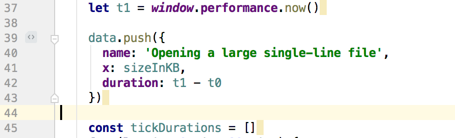
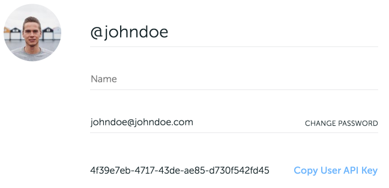
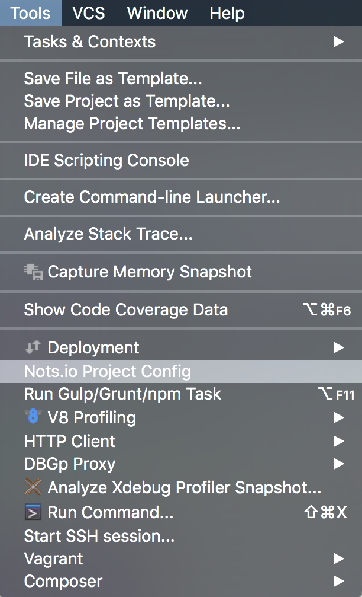
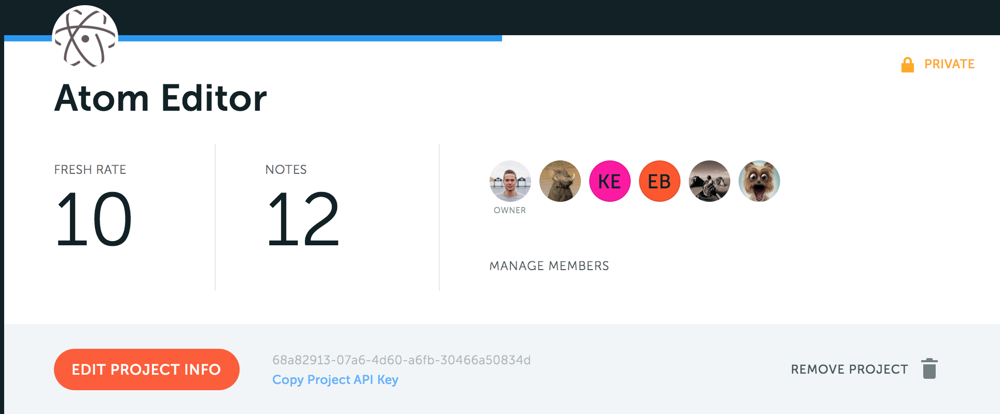
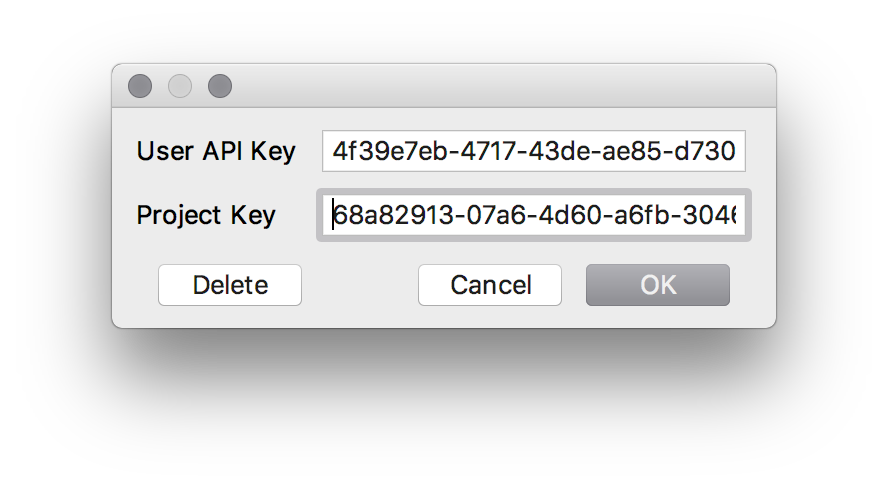

   
  

> The golden rule of documentation is to keep docs **close** to the code. [Nots.io](https://nots.io) lets you attach text, file or image directly to the source code. We track **changes** in it so your docs are always in-sync with the real source of truth — with your code.

## Nots.io JetBrains plugin

This plugin is an open-source extension for JetBrains' IDE family. It shows a gutter icon when there's a note added on this line in Nots.io.
 
Click on the gutter icon to get full information about the note, discussions and attached files on Nots.io site.

## Setting up the plugin

To make plugin work, it's required to set up Users API key and Project API key. 

### User API Key

First, go to [Nots.io](https://nots.io/login) site, the [Profile section](https://app.nots.io/settings/profile). 
Find and click `Copy User API Key` button 
Now User API Key is in your clipboard.

Switch to your ItelliJ IDEA/PhpStorm/WebStorm/PyCharm/RubyMine and choose `Tools > Nots.io Project Config` menu item

Click and paste User API Key in the dialog window.

### Project API Key

Now, on Nots.io site go to the index page of the project you want to integrate with, and click `Copy Project API Key`. 

The Project API Key is in your clipboard.

Switch to your ItelliJ IDEA/PhpStorm/WebStorm/PyCharm/RubyMine and paste the key into apropriate field.

## Requirements

* IntelliJ IDEA, PhpStorm, WebStorm, PyCharm, RubyMine, AppCode, CLion, GoLand, Rider, MPS, Android Studio
* macos, linux or windows

## Known Issues

[Open Bugs](https://github.com/notsio/idea/issues)

## Release Notes

### 1.4
Stable release with proper README